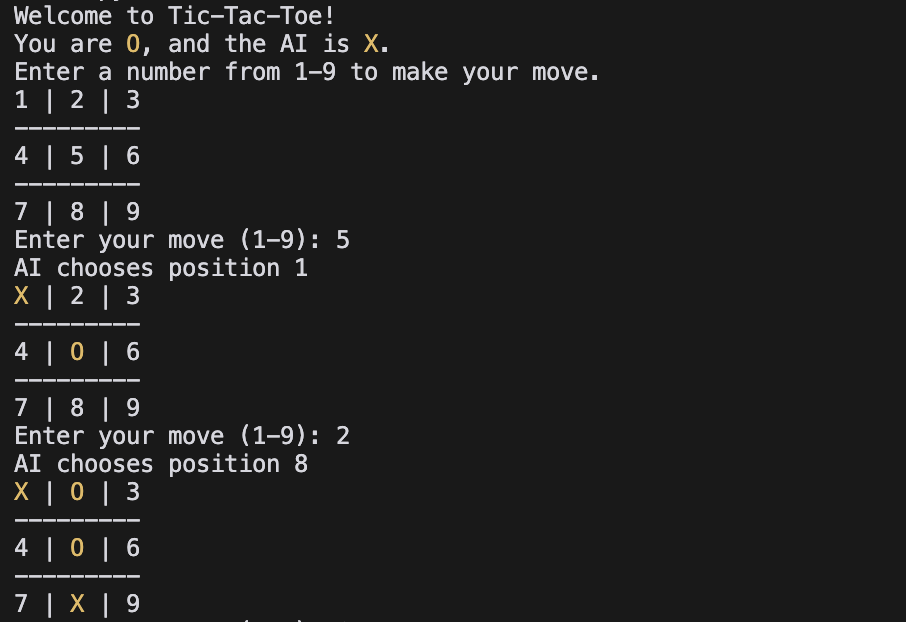

# Unbeatable Tic-Tac-Toe "AI" Using the Minimax Algorithm with Alpha-Beta Pruning

Tic-Tac-Toe is an ideal game to explore the concept of an unbeatable AI due to its simplicity and the guarantee that, when played optimally, a player can never lose. This project implements such an AI using the Minimax algorithm enhanced with Alpha-Beta Pruning.

The Minimax algorithm is a decision rule used in two-player games like Tic-Tac-Toe. The basic idea is to minimize the possible loss for a worst-case scenario:

- Maximizing Player: This player (in this case, the AI playing 'X') aims to maximize their score by choosing moves that lead to the highest possible outcome.
- Minimizing Player: The opponent (assumed to be playing 'O') aims to minimize the AI's score by choosing moves that reduce the potential maximum gain of the AI.

To further optimize performance, I incorporated Alpha-Beta Pruning, which reduces the number of nodes the AI needs to evaluate. This technique skips over branches of the decision tree that cannot influence the final outcome, speeding up the decision-making process without compromising the accuracy of the AI's choices.

To demonstrate the effectiveness of this approach, I ran a simulation where the AI played against a random bot and itself 1,000 times, yielding the following results:

## Simulation Results

### Minimax vs Random

- X (Minimax): 998 (99.80%)
- Draw: 2 (0.20%)
- O (Random): 0 (0.00%)

### Random vs Random

- X: 589 (58.90%)
- Draw: 129 (12.90%)
- O: 282 (28.20%)

### Minimax vs Minimax

- X: 0 (0.00%)
- Draw: 1000 (100.00%)
- O: 0 (0.00%)

## UI

